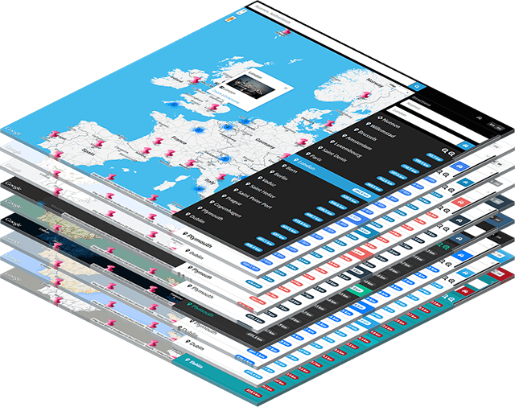

# Store Finder Pro
## Multi user store finder



Create Google Maps to embed on any website. Manage markers, content and design. For a demo and more information visit <http://madewithpepper.com/store-finder>.

## Installation

This version has all [Composer](https://getcomposer.org/) and [Bower](http://bower.io/) dependencies included so it works out of the box.

### Requirements
Make sure your server meets the following requirements:
 - PHP >= 5.4
 - MCrypt PHP Extension
 - Apache mod_rewrite
 - SQLite or MySQL

### Upload files
Upload all files in this directory to your webroot.

### Directory permissions
The /app/storage/ directory and all underlying files and directories need write permissions:
 - /app/storage/cache/
 - /app/storage/logs/
 - /app/storage/meta/
 - /app/storage/meta/services.json
 - /app/storage/sessions/
 - /app/storage/uploads/
 - /app/storage/views/

### Encryption key
In order to improve security, you should update the Encryption Key setting in `/app/config/app.php`. Search for 'key' and change the random string.

```php
/*
 |--------------------------------------------------------------------------
 | Encryption Key
 |--------------------------------------------------------------------------
 |
 | This key is used by the Illuminate encrypter service and should be set
 | to a random, 32 character string, otherwise these encrypted strings
 | will not be safe. Please do this before deploying an application!
 |
 */

'key' => 'mcMTR7QLdDWcOEmf2JAtyqy9URcbhIqO',
```

### Database
The Store Finder works out of the box with an SQLite database. However, if you want to use a MySQL database this is possible too.

If you want to use a MySQL database, create one on your server and execute the SQL script found at `/app/database/database.sql`. Open the file `/app/config/production/database.php` and change `'default' => 'sqlite'` to `'default' => 'mysql'`. Enter the database name, username and password at the lines below.

You can leave the SQLite reference intact, simply change the default driver. Now `/app/config/production/database.php` looks something like:

```php
return array(

	'default' => 'mysql',
	'connections' => array(

		'mysql' => array(
			'driver'    => 'mysql',
			'host'      => 'localhost',
			'database'  => 'database_name',
			'username'  => 'user',
			'password'  => 'pass',
		),

		'sqlite' => array(
			'database' => app_path() .'/database/production.sqlite',
		),
	),
);
``` 

### Email configuration
To configure your email settings open  `/app/config/production/mail.php`. The file should be pretty self-explanatory.

### First login
After you've installed Store Finder Pro, visit the URL where you've installed it and login with the following credentials:

Email | Password
--- | ---
info@example.com | welcome

After login you will be prompted to change your e-mail address. 

### License
GNU General Public License v3.0